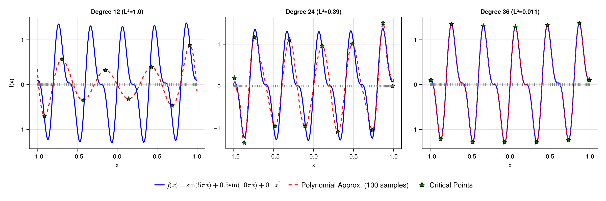

# Globtim.jl — Global Optimization via Polynomial Approximation

[](https://gescholt.github.io/Globtim.jl/stable/)
[](https://gescholt.github.io/Globtim.jl/dev/)

Finding all local minima of a continuous function over a bounded domain is fundamentally hard. Standard optimization algorithms (gradient descent, BFGS, etc.) find *one* local minimum from a given starting point — but how do you know there isn't a better one elsewhere?

Globtim solves this by replacing your function with a polynomial approximation. Setting the gradient of the polynomial to zero gives a polynomial system whose solutions can be computed exactly using homotopy continuation. Each solution seeds a local refinement on the original function, recovering *all* local minima — not just the nearest one.

```
f(x)  -->  Polynomial p(x)  -->  Solve grad(p) = 0  -->  Refine with BFGS  -->  All minima
           (Chebyshev/Legendre)   (HomotopyContinuation.jl)
```

### Challenging 1D function — multi-frequency oscillations at varying polynomial degrees:



### Styblinski-Tang 2D — classic test function with polynomial approximation:


## Installation

```julia
using Pkg
Pkg.add("Globtim")
```

For the latest development version:
```julia
Pkg.add(url="https://github.com/gescholt/Globtim.jl")
```

## Quick Start

```julia
using Globtim, DynamicPolynomials

# Define a test function (or use your own)
f = Deuflhard  # Built-in test function

# Define domain: center and sampling range
TR = TestInput(f, dim=2, center=[0.0, 0.0], sample_range=1.2)

# Create polynomial approximation (degree 8)
pol = Constructor(TR, 8, precision=AdaptivePrecision)
println("L2-norm approximation error: $(pol.nrm)")

# Find all critical points
@polyvar x[1:2]
solutions = solve_polynomial_system(x, pol)
df = process_crit_pts(solutions, f, TR)

# Identify local minima
df_enhanced, df_min = analyze_critical_points(f, df, TR, enable_hessian=true)
println("Found $(nrow(df_min)) local minima")
```

## Running Experiments with TOML Configs

Experiments can be driven entirely by TOML configuration files, which specify the function, domain, polynomial degree, solver, and refinement settings:

```bash
julia --project=. globtim/scripts/run_experiment.jl experiments/configs/ackley_3d.toml
```

Example config for a static benchmark:

```toml
[experiment]
name = "ackley_3d"

[domain]
bounds = [[-5.0, 5.0], [-5.0, 5.0], [-5.0, 5.0]]

[polynomial]
GN = 12
degree_range = [4, 2, 10]
basis = "chebyshev"

[refinement]
enabled = true
method = "NelderMead"
```

## Polynomial Basis Options

Two orthogonal polynomial bases are supported:

- **`:chebyshev`** (default): Chebyshev polynomials — standard choice, well-tested
- **`:legendre`**: Legendre polynomials — often better conditioning (lower condition numbers)

```julia
pol = Constructor(TR, 8, basis=:chebyshev, precision=AdaptivePrecision)  # Default
pol = Constructor(TR, 8, basis=:legendre, precision=AdaptivePrecision)   # Alternative
```

## Precision Control

Globtim supports multiple precision types for balancing accuracy and performance:

| Precision | Performance | Accuracy | Best For |
|-----------|-------------|----------|----------|
| `Float64Precision` | Fast | Good | General use |
| `AdaptivePrecision` | Good | Excellent | **Recommended default** |
| `RationalPrecision` | Slow | Exact | Symbolic work |
| `BigFloatPrecision` | Slowest | Maximum | Research |

```julia
pol = Constructor(TR, 8, precision=AdaptivePrecision)
```

## Solvers

Two solvers are available for computing critical points:

1. **[HomotopyContinuation.jl](https://www.juliahomotopycontinuation.org/)** (default) — numerical algebraic geometry
2. **[msolve](https://msolve.lip6.fr/)** — symbolic method based on Groebner basis computations

## Ecosystem

Globtim is part of a three-package ecosystem:

| Package | Purpose | Install |
|---------|---------|---------|
| **Globtim** | Polynomial approximation and critical point finding | `Pkg.add("Globtim")` |
| **[GlobtimPostProcessing](https://github.com/gescholt/globtimpostprocessing)** | Refinement, validation, parameter recovery | `Pkg.add(url="https://github.com/gescholt/globtimpostprocessing")` |
| **[GlobtimPlots](https://github.com/gescholt/globtimplots)** | Visualization (CairoMakie/GLMakie) | `Pkg.add(url="https://github.com/gescholt/globtimplots")` |

```
Globtim (experiments) --> GlobtimPostProcessing (analysis) --> GlobtimPlots (visualization)
```

## Repository Organization

```
Globtim.jl/
├── src/                    # Core package source
│   ├── Globtim.jl          # Main module
│   ├── ApproxConstruct.jl  # Polynomial construction
│   ├── hom_solve.jl        # Homotopy continuation solver
│   └── ...
├── ext/                    # Package extensions
│   └── GlobtimCUDAExt.jl   # GPU acceleration (experimental)
├── test/                   # Test suite
├── docs/                   # Documenter.jl documentation
├── scripts/                # Experiment runner scripts
└── .github/workflows/      # CI (tests, docs, TagBot, CompatHelper)
```

## License

GPL-3.0
