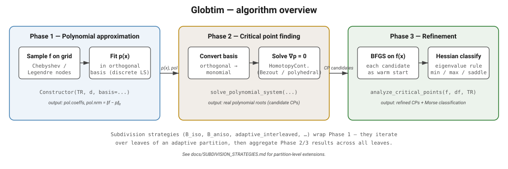

# Core Algorithm

Globtim's approach to global optimization consists of three main phases:



Subdivision strategies (`:B_iso`, `:B_aniso`, `:adaptive_interleaved`, …) wrap Phase 1 — they iterate over leaves of an adaptive partition, then aggregate Phase 2/3 results across all leaves.

## 1. Polynomial Approximation

The first step constructs a polynomial approximation of the objective function using discrete least squares. For detailed coverage of approximation methods, see [Polynomial Approximation](polynomial_approximation.md).

### Sampling Strategy

Globtim uses tensorized Chebyshev or Legendre grids for function sampling:

```julia
# Create polynomial approximation
pol = Constructor(
    TR,                  # Test input specification
    degree;              # Polynomial degree
    basis = :chebyshev,  # Basis type (default; :legendre also supported)
)
```

The sampling points are chosen to minimize approximation error and avoid Runge's phenomenon.

### Approximation Quality

The `Constructor` returns a polynomial with an L2-norm error estimate:

```julia
pol = Constructor(TR, 8)
println("Approximation error: ", pol.nrm)

# Access polynomial coefficients
coeffs = pol.coeffs  # Coefficient matrix
```

The L2-norm can be computed using either Riemann sums or high-accuracy quadrature methods. For details on polynomial post-processing and sparsification, see [Polynomial Sparsification](sparsification.md).

### Basis Functions

Two basis types are supported:

- **Chebyshev polynomials** (default): Standard choice for polynomial approximation; near-minimax property
- **Legendre polynomials**: Alternative basis with different convergence properties

## 2. Critical Point Finding

Once we have a polynomial approximation, we find all its critical points by solving:

∇p(x) = 0

where p(x) is our polynomial approximation.

### Polynomial System Setup

```julia
using DynamicPolynomials
using HomotopyContinuation  # provides the default :hc solver (weak-dependency extension)

# Define polynomial variables
@polyvar x[1:n_dims]

# Solve the system
solutions = solve_polynomial_system(
    x,          # Variables
    n_dims,     # Dimension
    degree,     # Polynomial degree
    pol.coeffs  # Coefficients
)
```

### Solver Options

Two solvers are available:

1. **[HomotopyContinuation.jl](https://www.juliahomotopycontinuation.org/)** (default): Numerical algebraic geometry solver (Breiding & Timme, 2018)

2. **[msolve](https://msolve.lip6.fr/)**: Symbolic solver based on Gröbner basis computations (Berthomieu, Eder & Safey El Din, 2021)

For detailed solver configuration and selection guidelines, see [Polynomial System Solvers](solvers.md).

### Solution Processing

Raw solutions are processed to extract valid critical points:

```julia
df = process_crit_pts(
    solutions,    # Raw solutions
    f,           # Original function
    TR,          # Domain specification
    solver="HC"  # Solver used
)
```

This function:
- Filters complex solutions
- Checks domain boundaries
- Evaluates function at each point
- Removes duplicates

## 3. Refinement and Classification

The polynomial critical points are approximate. The final phase refines them using BFGS optimization.

### BFGS Refinement

Each critical point is used as a starting point for local optimization:

```julia
df_enhanced, df_min = analyze_critical_points(
    f, df, TR,
    max_iters_in_optim=100,     # BFGS iterations
    bfgs_g_tol=1e-8,           # Gradient tolerance
    bfgs_f_abstol=1e-8,        # Function tolerance
    tol_dist=0.025             # Clustering distance
)
```

### Convergence Tracking

The refinement process tracks:
- Number of iterations required
- Whether optimization converged
- Distance from initial to refined point
- Function value improvement

## Algorithm Parameters

### Polynomial Degree

For smooth functions, higher polynomial degrees generally improve approximation but increase cost.

### Domain Scaling

The `sample_range` parameter controls the search domain:
```julia
# Symmetric domain
TR = TestInput(f, dim=2, center=[0,0], sample_range=1.0)

# Asymmetric domain  
TR = TestInput(f, dim=2, center=[0,0], sample_range=[2.0, 1.0])
```

### Tolerance Settings

Key tolerances affecting results:
- `tol_dist`: Distance for clustering critical points (default: 0.025)
- `bfgs_g_tol`: Gradient tolerance for refinement (default: 1e-8)
- `hessian_tol_zero`: Zero eigenvalue threshold (default: 1e-8)

## Performance Considerations

### Computational Complexity

- Polynomial construction: O(g^n) where g = sample points per dimension, n = dimension (the grid is a tensor product of GN+1 nodes per axis)
- System solving: depends on the number of critical points, bounded by Bézout at ≤ (d−1)^n for a degree-d approximation in n variables — exponential in dimension in the worst case
- Refinement: O(k × m) where k = critical points, m = BFGS iterations

### Memory Usage

- Polynomial storage: O(d^n) coefficients
- Solution storage: Proportional to number of critical points
- Hessian analysis: Additional O(n²) per critical point

### Scalability Tips

1. Start with lower polynomial degrees
2. Use appropriate domain bounds
3. Enable parallel processing where available
4. Consider dimension-adaptive strategies for high dimensions