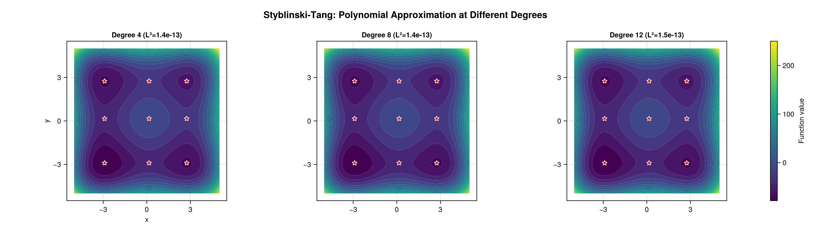

# Ecosystem Walkthrough

This page takes **one** objective function all the way through the three packages
that make up the Globtim ecosystem — from a raw function to a refined, plotted set of
minima. If you only read one page after [Getting Started](getting_started.md), read
this one.

## The three packages

Globtim is split into three packages with a strict one-way dataflow:

```
   globtim                 globtimpostprocessing            globtimplots
 (find candidates)   →   (refine & validate them)    →    (visualize)
 polynomial approx +      Optim refinement (g-tol 1e-8,     Makie level sets,
 critical-point solve     ~1e-12 high-prec), grad checks,    Morse spectra,
                          parameter recovery                convergence plots
```

Each stage consumes the previous stage's output and never depends on a later one.
You can stop at any stage — globtim alone gives you critical points; the other two
add accuracy and pictures.

### Install

`Globtim` is registered in the General registry; the two companion packages are
installed from their public repositories:

```julia
using Pkg
Pkg.add("Globtim")                                                  # core (registered)
Pkg.add(url="https://github.com/gescholt/GlobtimPostProcessing.jl") # refinement & analysis
Pkg.add(url="https://github.com/gescholt/GlobtimPlots.jl")          # visualization
Pkg.add("CairoMakie")                                               # a Makie backend for plotting
```

## Step 1 — Define an objective

Any function that takes a vector `x` and returns a scalar works. We use a function
with four known minima near `(±1, ±1)`:

```julia
using Globtim
using DynamicPolynomials   # for @polyvar

my_objective(x) = (x[1]^2 - 1)^2 + (x[2]^2 - 1)^2 + 0.1 * sin(10 * x[1] * x[2])
```

!!! note "Objectives from DynamicObjectives.jl"
    Objectives don't have to be hand-written. The collaborator package
    [DynamicObjectives.jl](https://github.com/gescholt/DynamicObjectives.jl) supplies a
    catalogue of ODE-based objective functions — parameter-estimation landscapes from
    dynamical-systems models — that drop into the workflow below in place of `my_objective`.

## Step 2 — globtim finds the critical points

globtim approximates `my_objective` by a polynomial on the box, then solves
`∇p = 0` exactly and classifies the resulting critical points. The five calls below
are the core workflow (the same sequence appears in
[`examples/custom_function_demo.jl`](https://github.com/gescholt/Globtim.jl/blob/main/examples/custom_function_demo.jl)):

```julia
using HomotopyContinuation   # loads the :hc solver extension

# 1. Problem specification: domain [-2,2] × [-2,2]
TR  = TestInput(my_objective, dim=2, center=[0.0, 0.0], sample_range=2.0)

# 2. Degree-10 Chebyshev approximation
pol = Constructor(TR, 10, precision=AdaptivePrecision)

# 3. Solve ∇p = 0 for critical points
@polyvar x[1:2]
solutions = solve_polynomial_system(x, pol)

# 4. Map solutions back to the domain and evaluate the true objective
df = process_crit_pts(solutions, my_objective, TR)

# 5. Refine + classify (minimum / saddle / maximum via the Hessian)
df_enhanced, df_min = analyze_critical_points(my_objective, df, TR; enable_hessian=true)
```

`df_min` now holds the local minima (columns `x1`, `x2`, `value`, …). For this
objective you should recover the four `(±1, ±1)` minima. That is already a usable
result — but the coordinates are only as accurate as the degree-10 polynomial fit
(typically `~1e-3`). The next stage sharpens them.

!!! note "Why the `using HomotopyContinuation` line"
    The polynomial solver is a package extension that activates only when
    HomotopyContinuation is loaded. It is the default (`solver=:hc`) and the only
    solver that scales past two dimensions. See [Solvers](solvers.md).

## Step 3 — globtimpostprocessing refines & validates

`GlobtimPostProcessing` takes the raw critical points (accurate to the polynomial
fit) and refines them with a local optimizer — to gradient norm `1e-8` by default,
down to `~1e-12` in high-precision mode — and checks that each is genuinely a critical
point of the *true* objective (small gradient):

```julia
using GlobtimPostProcessing

# In-memory gradient validation: is each candidate actually a critical point of f?
points = [[row.x1, row.x2] for row in eachrow(df_min)]
report = validate_critical_points(points, my_objective; tolerance=1e-6)
println("Valid critical points: $(report.n_valid)/$(length(points))")

# For a saved experiment directory, the full refinement pipeline sharpens the raw
# ~1e-3 candidates (to ~1e-12 in high-precision mode) and writes refined CSV/JSON:
#   result = refine_experiment_results(output_dir, my_objective, RefinementConfig())
```

This is the stage that turns "approximately right" coordinates into publishable
numbers. It also computes parameter-recovery and quality diagnostics — see the
[GlobtimPostProcessing repository](https://github.com/gescholt/GlobtimPostProcessing.jl).

## Step 4 — globtimplots visualizes

`GlobtimPlots` renders the polynomial level set with the critical points overlaid.
Load a Makie backend **before** calling any plot function — `CairoMakie` for static,
publication-quality files; `GLMakie` for interactive windows:

```julia
using GlobtimPlots
using CairoMakie   # static backend; use GLMakie instead for interactivity

# Adapt the globtim objects into the plain structs GlobtimPlots consumes
apol = adapt_polynomial_data(pol)
ainp = adapt_problem_input(TR)

fig = cairo_plot_polyapprox_levelset(
    apol, ainp, df_enhanced, df_min;
    title = "my_objective — polynomial level set (Chebyshev, d = 10)",
    xlabel = "x₁", ylabel = "x₂", colorbar_label = "f(x)",
)
CairoMakie.save("my_objective_levelset.png", fig)
```



*(Shown: a Globtim polynomial approximation of the Styblinski–Tang surface. Your
`my_objective` level-set plot has the same anatomy — contours plus the recovered
critical points. The full gallery, including the level-set-with-critical-points figure,
is regenerated by [`examples/gallery.jl`](https://github.com/gescholt/GlobtimPlots.jl/blob/main/examples/gallery.jl).)*

`GlobtimPlots` also draws Morse spectra, adaptive-subdivision partitions, and
degree-convergence plots — see [GlobtimPlots](https://github.com/gescholt/GlobtimPlots.jl) and the
[GlobtimPlots repository](https://github.com/gescholt/GlobtimPlots.jl).

## Where to go next

- [Getting Started](getting_started.md) — the globtim workflow in more detail
- [Examples](examples.md) — the eight runnable demo scripts shipped in the package's `examples/` directory
- [Core Algorithm](core_algorithm.md) — what happens inside Step 2
- [Critical Point Analysis](critical_point_analysis.md) — classification and statistics
- [Solvers](solvers.md) — HomotopyContinuation vs. msolve
