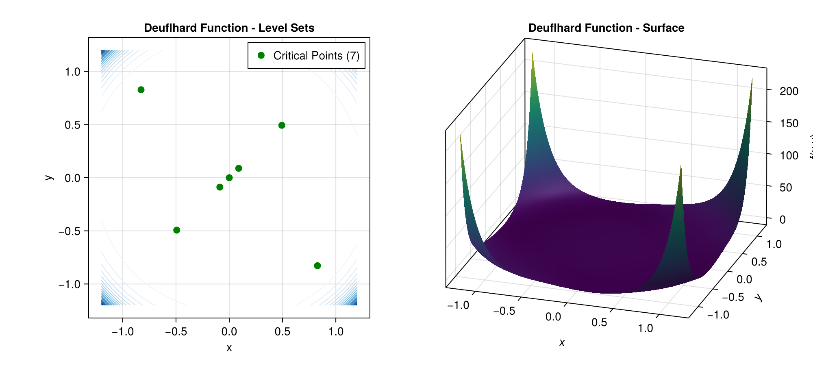
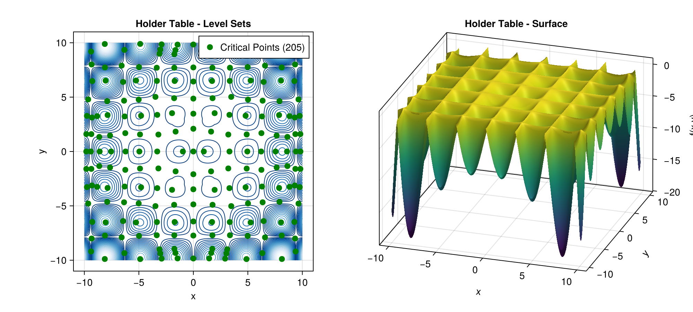
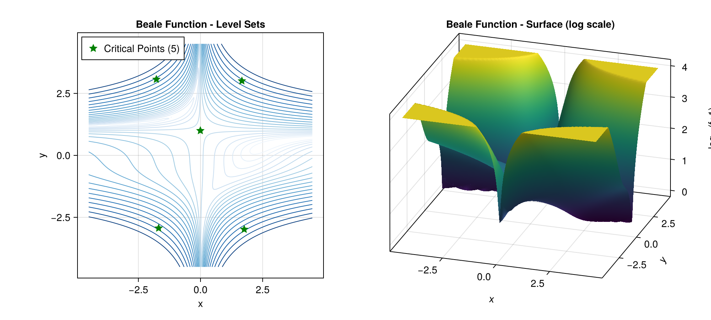
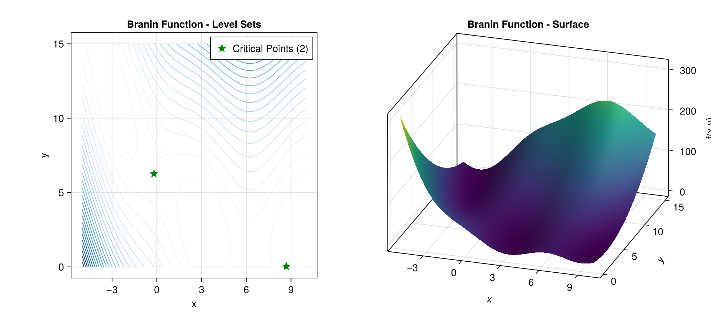

# Examples

This page provides pointers to runnable example files demonstrating Globtim features. Run examples from the globtimcore root directory.

## Running Examples

```bash
julia --project=. Examples/hpc_minimal_2d_example.jl
```

## Quick Reference

| Feature | Example File | Description |
|---------|--------------|-------------|
| Basic 2D workflow | `Examples/hpc_minimal_2d_example.jl` | Complete polynomial → critical points |
| Custom objectives | `Examples/custom_function_demo.jl` | User-defined functions |
| Sparsification | `Examples/sparsification_demo.jl` | Coefficient truncation |
| Anisotropic grids | `Examples/anisotropic_grid_demo.jl` | Non-uniform spacing |
| High-dimensional | `Examples/high_dimensional_demo.jl` | 3D/4D problems |
| Domain exploration | `Examples/domain_sweep_demo.jl` | Domain size effects |
| 1D functions | `Examples/scalar_function_demo.jl` | Scalar input functions |
| Degree comparison | `Examples/polynomial_basis_comparison.jl` | Chebyshev vs Legendre |

---

## Test Function Gallery

Visual examples of Globtim finding critical points on standard benchmark functions.

### Deuflhard


### Holder Table


### Beale


### Branin


---

## Basic 2D Workflow

**See:** `Examples/hpc_minimal_2d_example.jl`

**Core API sequence:**

| Step | API Call |
|------|----------|
| 1. Define problem | `test_input(f, dim=2, center=[0.0,0.0], sample_range=1.2)` |
| 2. Build polynomial | `Constructor(TR, degree)` |
| 3. Find critical pts | `solve_polynomial_system(x, pol)` |
| 4. Process solutions | `process_crit_pts(solutions, f, TR)` |
| 5. Analyze & classify | `analyze_critical_points(f, df, TR, enable_hessian=true)` |

---

## Custom Objective Functions

**See:** `Examples/custom_function_demo.jl`

Define any function accepting a vector `x` and returning a scalar:

```julia
my_function(x) = (x[1]^2 - 1)^2 + (x[2]^2 - 1)^2 + 0.1*sin(10*x[1]*x[2])
```

---

## Statistical Analysis with Tables

**See:** `Examples/hierarchical_experiment_example.jl`

**API pattern:**
```julia
df_enhanced, df_min, tables, stats = analyze_critical_points_with_tables(f, df, TR, show_tables=true)
```

Export options: `write_tables_to_csv()`, `write_tables_to_markdown()`, `write_tables_to_latex()`

---

## High-Dimensional Problems (3D/4D)

**See:** `Examples/high_dimensional_demo.jl`

**Tips:**
- Use `AdaptivePrecision` for accuracy/performance balance
- Reduce polynomial degree as dimension increases (4D → degree 4-6)
- Disable Hessian analysis for faster results: `enable_hessian=false`

---

## Domain Exploration

**See:** `Examples/domain_sweep_demo.jl`

Test different domain sizes to find all critical points:

```julia
TR = test_input(f, dim=2, center=[0.0, 0.0], sample_range=r)      # uniform
TR = test_input(f, dim=2, center=[0.0, 0.0], sample_range=[2.0, 1.0])  # rectangular
```

---

## Visualization

For plotting critical points and convergence analysis, use the **globtimplots** package:

```julia
using GlobtimPlots
fig = plot_critical_points(df_enhanced)
fig = plot_convergence(results)
```

See `globtimplots` documentation for available plot types.

---

## Polynomial Degree Comparison

**See:** `Examples/polynomial_basis_comparison.jl`

Compare Chebyshev vs Legendre bases and analyze how polynomial degree affects approximation quality and critical point discovery.

---

## 1D Functions with Scalar Input

**See:** `Examples/scalar_function_demo.jl`

Works with functions like `sin`, `cos` that expect scalar input:

```julia
f = x -> sin(3x) + 0.1*x^2
TR = test_input(f, dim=1, center=[0.0], sample_range=π)
```

---

## Basin Analysis

**See:** `Examples/validation_integration_test.jl`

Analyze convergence basins for critical points. The `df_min` DataFrame includes:
- `basin_points` - Number of points converging to this minimum
- `average_convergence_steps` - Mean BFGS iterations
- `region_coverage_count` - Spatial coverage metric

---

## Advanced Examples

| Example | Description |
|---------|-------------|
| `Examples/standardized_experiment_template.jl` | Template for reproducible experiments |
| `Examples/automated_experiment_template.jl` | Batch experiment automation |
| `Examples/random_p_true_example.jl` | Parameter estimation workflows |
| `Examples/quick_subdivision_demo.jl` | Adaptive subdivision methods |

---

## Next Steps

- [Getting Started](getting_started.md) - Basic concepts and setup
- [API Reference](api_reference.md) - Complete function documentation
- [Precision Parameters](precision_parameters.md) - Numerical precision options
- [Sparsification](sparsification.md) - Polynomial complexity reduction
