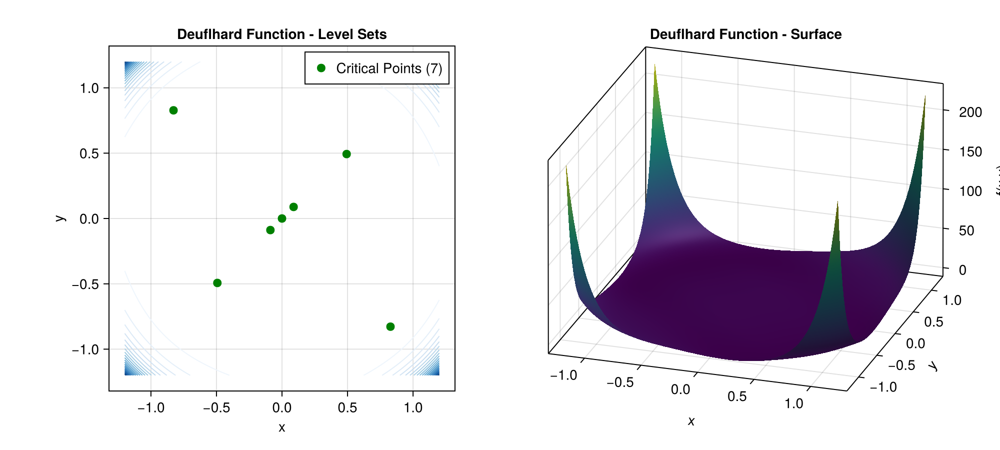

# Examples

Every code block on this page is **executed when the documentation is built**, so the output shown is real.

## A complete example

The full workflow on a smooth four-well objective — approximate, find *every* critical point, then keep the minima:

```@example fourwell
using Globtim, DynamicPolynomials, HomotopyContinuation

# Four-well objective: global minima at (±1, ±1), a maximum at the origin, four saddles.
f(x) = (x[1]^2 - 1)^2 + (x[2]^2 - 1)^2

TR  = TestInput(f, dim=2, center=[0.0, 0.0], sample_range=1.5)   # search box [-1.5, 1.5]²
pol = Constructor(TR, 8)                                          # degree-8 Chebyshev fit

@polyvar x[1:2]
sols = solve_polynomial_system(x, pol)                           # solve ∇p = 0
df   = process_crit_pts(sols, f, TR)                             # → true critical points of f
df_enhanced, df_min = analyze_critical_points(f, df, TR; enable_hessian = true, verbose = false)

println("L² approximation error : ", round(pol.nrm, sigdigits = 3))
println("critical points found  : ", size(df, 1))
println("minima found           : ", size(df_min, 1))
```

Degree 8 recovers this quartic essentially exactly (`pol.nrm ≈ 1e-15`), and Globtim finds all **nine** critical points — the four global minima at (±1, ±1), plus four saddles and the central maximum. The recovered minima:

```@example fourwell
using DataFrames   # nrow/eachrow come from DataFrames, which analyze_critical_points returns
sort!(df_min, [:x1, :x2])
[(round(r.x1, digits = 3), round(r.x2, digits = 3)) for r in eachrow(df_min)]
```

## Runnable demo scripts

Self-contained scripts ship in the [`examples/`](https://github.com/gescholt/Globtim.jl/tree/main/examples) directory. Run any of them from a project that has Globtim installed (e.g. `julia examples/custom_function_demo.jl`):

| Script | What it shows |
|---|---|
| `custom_function_demo.jl` | Define a custom 2D objective, build the approximation, find critical points |
| `quick_subdivision_demo.jl` | Adaptive subdivision on sphere / Rosenbrock / Rastrigin / anisotropic |
| `domain_sweep_demo.jl` | Sweep over domain sizes for a fixed objective |
| `high_dimensional_demo.jl` | 3D / 4D scaling behaviour |
| `scalar_function_demo.jl` | 1D scalar functions |
| `sparsification_demo.jl` | Polynomial coefficient sparsification |
| `anisotropic_grid_demo.jl` | Anisotropic Chebyshev / Legendre grids |
| `basis_comparison.jl` | Chebyshev vs Legendre nodes / convergence on the 1D Runge function |

For an end-to-end tour across the whole package family (find → refine → plot), see the [Ecosystem Walkthrough](ecosystem_walkthrough.md).

## Custom objectives

Any function that accepts a vector `x` and returns a scalar works. Here a tilted double-well finds its two minima:

```@example custom
using Globtim, DynamicPolynomials, HomotopyContinuation

g(x) = (x[1]^2 - 1)^2 + x[2]^2 + 0.3 * x[1]   # tilt breaks the symmetry between the wells
TR = TestInput(g, dim = 2, center = [0.0, 0.0], sample_range = 1.5)
pol = Constructor(TR, 8)
@polyvar x[1:2]
df = process_crit_pts(solve_polynomial_system(x, pol), g, TR)
_, df_min = analyze_critical_points(g, df, TR; enable_hessian = true, verbose = false)
println("minima: ", size(df_min, 1), "  (global at the deeper, tilted-down well)")
```

## 1D functions with scalar input

For `dim = 1`, Globtim accepts ordinary scalar functions (`sin`, `cos`, …):

```@example onedim
using Globtim, DynamicPolynomials, HomotopyContinuation

f = x -> sin(3x) + 0.1x^2
TR = TestInput(f, dim = 1, center = [0.0], sample_range = Float64(π))
pol = Constructor(TR, 12)
@polyvar x[1:1]
df = process_crit_pts(solve_polynomial_system(x, pol), f, TR)
_, df_min = analyze_critical_points(f, df, TR; enable_hessian = true, verbose = false)
println("critical points: ", size(df, 1), "   minima: ", size(df_min, 1))
```

## Domain size matters

Globtim finds the critical points **inside the search box**. Widen the box to capture more of them, and use a rectangular box (`sample_range` as a vector) for anisotropic domains:

```julia
TR = TestInput(f, dim = 2, center = [0.0, 0.0], sample_range = 1.5)        # square [-1.5, 1.5]²
TR = TestInput(f, dim = 2, center = [0.0, 0.0], sample_range = [2.0, 1.0]) # rectangle [-2,2]×[-1,1]
```

## High-dimensional problems (3D / 4D)

The same workflow scales to 3D and 4D. Practical tips:

- Reduce the polynomial degree as dimension grows (4D → degree 4–6 is often enough for smooth objectives).
- Use `precision = AdaptivePrecision` when you need higher-accuracy coefficients (e.g. for sparsification or the symbolic solver).
- Pass `enable_hessian = false` to `analyze_critical_points` for a faster pass when you only need the minima.

See `high_dimensional_demo.jl` for a worked 3D/4D scaling example.

## Visualization

Plotting the polynomial level set with critical points overlaid lives in the [GlobtimPlots](https://github.com/gescholt/GlobtimPlots.jl) package. Load a Makie backend (`CairoMakie` for static files, `GLMakie` for interactive windows) **before** calling any plot function:

```julia
using GlobtimPlots, CairoMakie

apol = adapt_polynomial_data(pol)    # adapt Globtim objects for plotting
ainp = adapt_problem_input(TR)
fig  = cairo_plot_polyapprox_levelset(apol, ainp, df_enhanced, df_min)
CairoMakie.save("levelset.png", fig)
```

See the [GlobtimPlots repository](https://github.com/gescholt/GlobtimPlots.jl) for the full set of plot types (Morse spectra, subdivision partitions, convergence sweeps).

## Statistical analysis and tables

Enhanced statistics and CSV / Markdown / LaTeX table export live in [GlobtimPostProcessing](https://github.com/gescholt/GlobtimPostProcessing.jl), which consumes the `df_enhanced` DataFrame produced above:

```julia
using GlobtimPostProcessing
export_analysis_tables(tables, "critical_point_analysis", output_dir; formats = [:csv, :markdown, :latex])
```

## Test-function gallery

Globtim on the Deuflhard test function — sample grid, polynomial approximant, and recovered minima:



More benchmark objectives (Beale, Branin, Hölder Table, …) are available as built-in test functions; see the [FUNCTION_REGISTRY](api_reference.md) and `examples/` scripts to reproduce them.

## Next steps

- [Getting Started](getting_started.md) — basic concepts and setup
- [Core Algorithm](core_algorithm.md) — the mathematical approach
- [API Reference](api_reference.md) — the rendered function reference
- [Precision](precision_parameters.md) — precision types and trade-offs
- [Sparsification](sparsification.md) — polynomial complexity reduction
